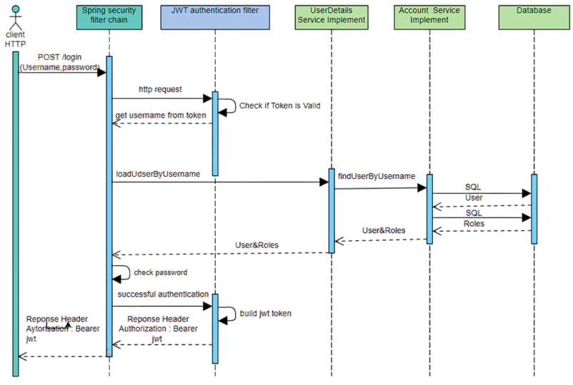

# IoT RFID Tracking and Identification Service

This project is a comprehensive IoT solution for tracking and identifying objects using **Radio-Frequency Identification (RFID)** technology. The service enables efficient object management by utilizing **RFID tags** and providing real-time tracking data over a **REST API**.

## Table of Contents
1. [Project Overview](#project-overview)
2. [Technology Stack](#technology-stack)
3. [Detailed Project Description](#detailed-project-description)
4. [Database Relationships](#database-relationships)
5. [Package and Class Structure](#package-and-class-structure)
6. [Spring Security and JSON Web Token](#spring-security-and-json-web-token)
7. [Prototype of RFID Reader based on ESP8266](#prototype-of-rfid-reader-based-on-esp8266)
8. [How to Use](#how-to-use)

---

## Project Overview
This project is an IoT service designed to track and identify objects using **RFID technology**. By implementing RFID tags for objects and integrating with a backend service, this solution allows for real-time data collection, monitoring, and management of various assets. The service provides a REST API for interaction, offering secure endpoints for managing data related to tracked objects.

---

## Technology Stack
- **Java, Spring Boot**: Backend development.
- **PostgreSQL**: Database management.
- **NodeMCU v3, RFID-RC522**: Hardware components for the RFID reader.
- **JWT, Spring Security**: Security and authentication.
- **Arduino IDE**: For programming the RFID reader.

---

## Detailed Project Description
For a full explanation of the project, including design decisions, implementation details, and testing, refer to the **Explanatory note**.

**Explanatory note**: [View Document](https://drive.google.com/file/d/1Qwzny58OMBryePvWp6ZP7bCAOKb-hp4t/view)

---

## Database Relationships
This section describes the relationships between the tables in the **PostgreSQL** database used by the service.

---

## Package and Class Structure

The service consists of several key components:

- **DTO**: Objects used for transferring data between different layers of the service.
- **Entity**: Objects representing data in the database.
- **Repository**: Interfaces for accessing the database.
- **Service**: The business logic of the application.
- **Facade**: A facade pattern to simplify interaction with other components.
- **Security**: Application security, including classes that provide configuration and handle security features, particularly for working with JWT tokens.
- **Web**: REST controllers for handling HTTP requests.
- **Exception**: Exception handling that ensures various types of errors are managed during the execution of the program logic.
- **Validation**: Data validation, ensuring correctness and accuracy.

---

## API Endpoints

The service includes several controllers to handle web requests using Spring Boot. Here are the key API endpoints:

### AuthController:
- `POST /api/auth/signin` - User authentication, returns JWT token.
- `POST /api/auth/signup` - User registration.

### ImageUploadController:
- `POST /api/image/upload` - Upload image for the current user.
- `POST /api/image/{itemId}/upload` - Upload image for a specific item.
- `GET /api/image/profileImage` - Retrieve the profile image of the current user.
- `GET /api/image/{itemId}/image` - Retrieve the image attached to a specific item.

### ItemController:
- `POST /api/item/create` - Create a new item.
- `POST /api/item/update` - Update item details.
- `POST /api/item/{rfTag}/update` - Update item details using an RFID tag.
- `GET /api/item/all` - Retrieve a list of all items.
- `GET /api/item/user/items` - Retrieve a list of all items for the current user.
- `POST /api/item/{itemId}/delete` - Delete an item.

### RemarkController:
- `POST /api/remark/{itemId}/create` - Create a remark for an item.
- `GET /api/remark/{itemId}/all` - Retrieve all remarks for an item.
- `POST /api/remark/{remarkId}/delete` - Delete a remark.

### UserController:
- `GET /api/user/` - Retrieve current user details.
- `GET /api/user/{userId}` - Retrieve user profile by ID.
- `POST /api/user/update` - Update user profile.

---

## Spring Security and JSON Web Token
The project uses **Spring Security** in combination with **JSON Web Token (JWT)** to ensure secure authentication and authorization of users. JWT tokens are used to securely verify user identity across different API endpoints.

---
## Prototype of RFID Reader based on ESP8266

**Radio-Frequency Identification (RFID)** is a technology that uses electromagnetic fields to automatically identify and track tags attached to objects. These tags contain electronically stored information that can be read by RFID readers. RFID systems are widely used in asset tracking, inventory management, and various other applications.

This project includes a prototype of an RFID reader built using the **NodeMCU v3 (ESP8266)** microcontroller and the **RFID-RC522** module. The reader communicates with the server over **Wi-Fi** to send object identification data.

The source code for the **ESP8266** microcontroller, which handles RFID tag reading and data transmission, is available below.

**Code for ESP**: [ESP8266_RFID.ino](ESP8266_RFID.ino)

**Link to an example of the RF reader's work**: [Video](https://youtu.be/KGE6DyLrMjc)

---

## How to Use
1. Deploy the backend using Spring Boot and connect to the PostgreSQL database.
2. Set up the RFID reader with NodeMCU v3 and connect it to the backend via Wi-Fi.
3. Use the provided REST API for operations such as tracking, identification, and management of objects.
4. Secure your API access with JWT-based authentication.

---
